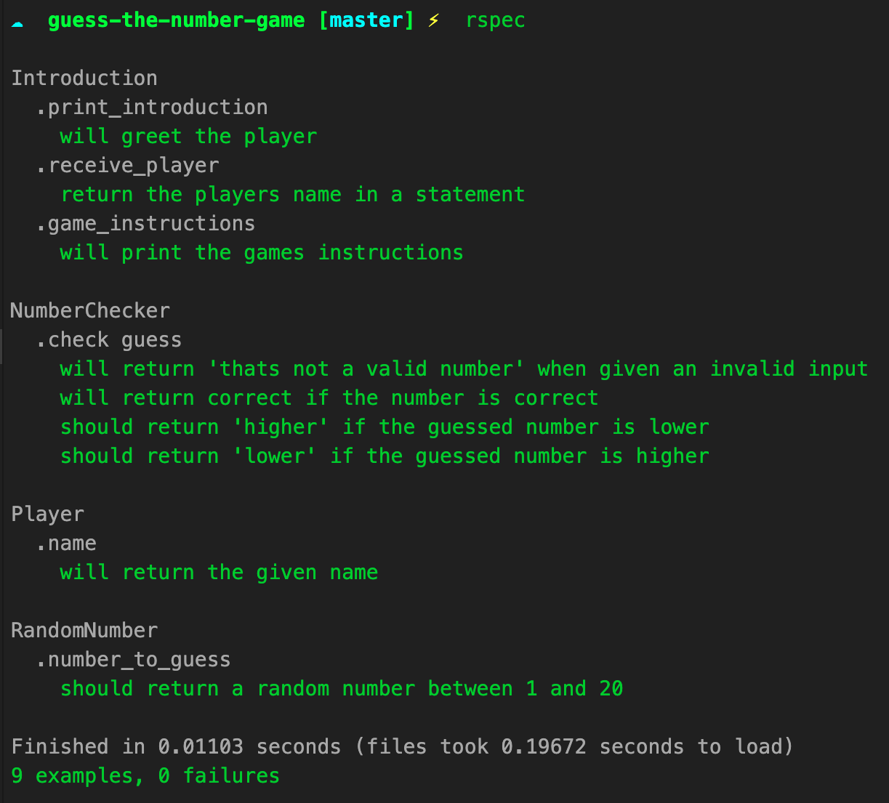

# Guess the number game

This is a game from the 'build your own computer games in python book'. I have decided to take on this project to train myself in TDD using a simple game project.

The current instructions for this game is for the player to guess a number between 1 - 20.

## Instructions:

To play this game run:
```
irb -r '.lib/guess_the_number'
```
When you are ready to finish with the game run `quit`

## User stories
```
As a player,
So that I can be welcomed into the game,
I would like the game to ask for my name.
```
```
As a player,
So that I can understand the game,
I would like the game to print the games instructions.
```
```
As a player,
So that I can play the game,
I would like the game to randomly pick a number.
```
```
As a player,
So that I can play the game,
I would like to be able to guess a number.
```
```
As a player,
So that I can learn from my mistakes,
I would like to be told if my answer is right or wrong.
```
```
As a player,
So that I can get closer to the number,
I would like to be told if my guess is too high or too low.
```
### Developer Notes:

I have come back to this after a while of not working on it. I will want to refactor alot of the functions here as well as add tests for user inputs, stubbing other classes etc.


### Tests:

I need to read through all the tests to see what tests I have and why.

Currently there are 9 tests across 5 suites. I need to add test coverage gem.


